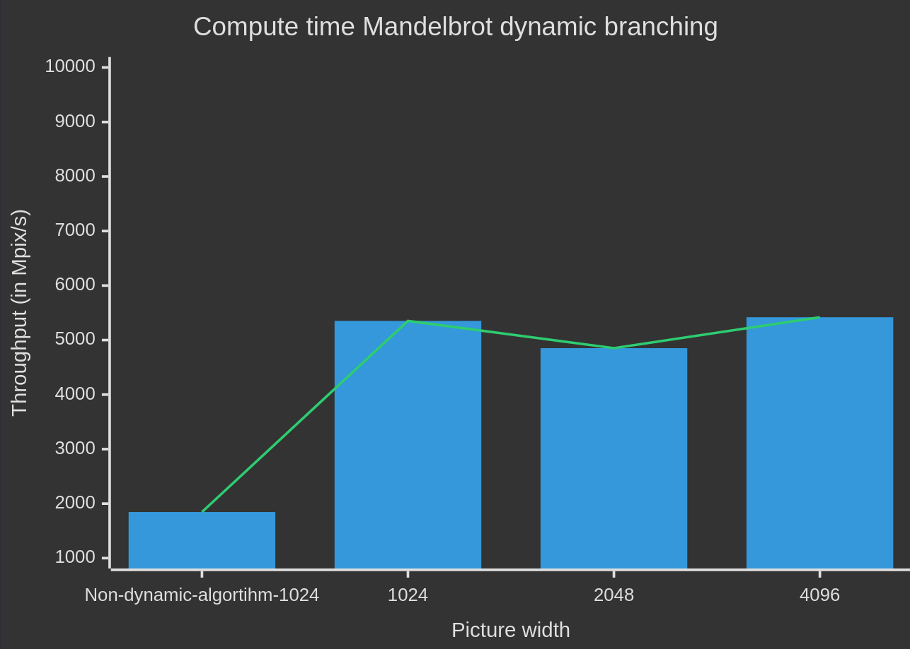

# Dynamic Parallelism measurements

The following image shows **throughput** measurements for various problem sizes: first, we measured the throughput for the naive implementation with an image width of 1024, then we did the same for the *dynamic parallelism* implementation.

## Commments

As we can see, the throughput dips at a problem size of 2048. The algorithm works by checking the border pixels of a subdivision of the total computation size. If all pixels are determined to be of the same color, the algorithm skips further computation to save resources (since this means that all pixels within the border will be of the same color, so the mandelbrot equation doesn't have to be evaluated). It is possible that more divergent subdivisions are created for the problem size of 2048 compared to the other two measurements, causing the algorithm to evaluate the equation more often, and therefore decreasing throughput.